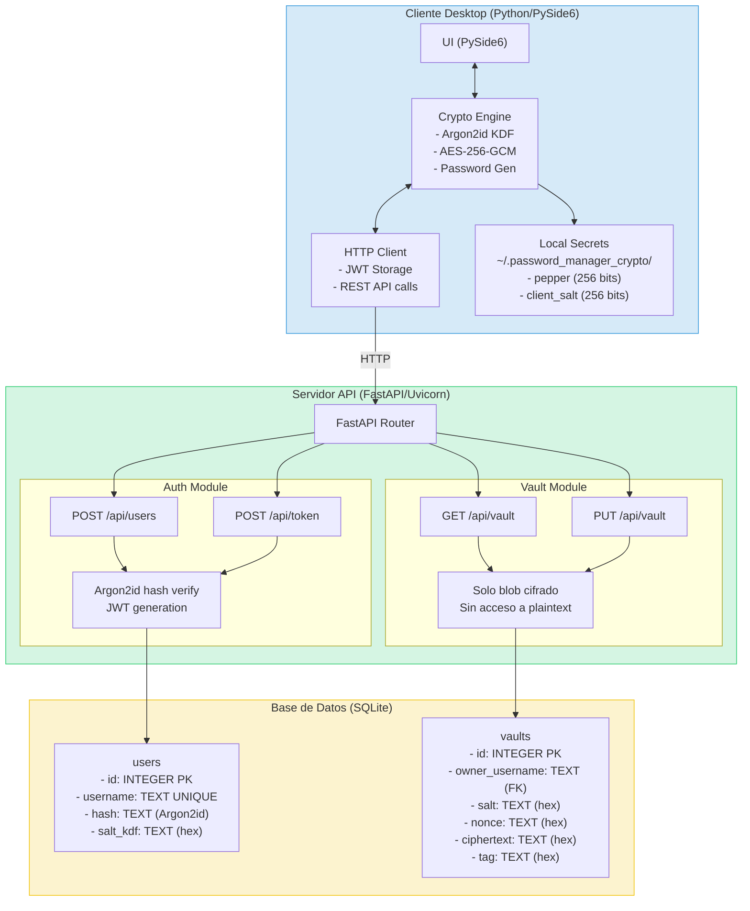
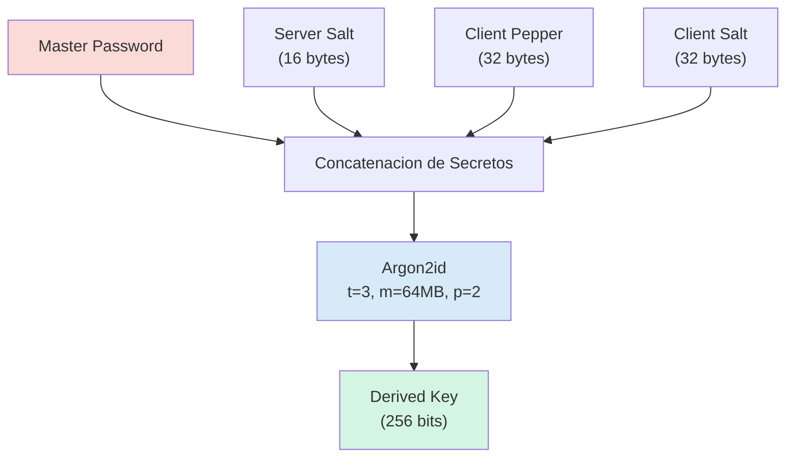
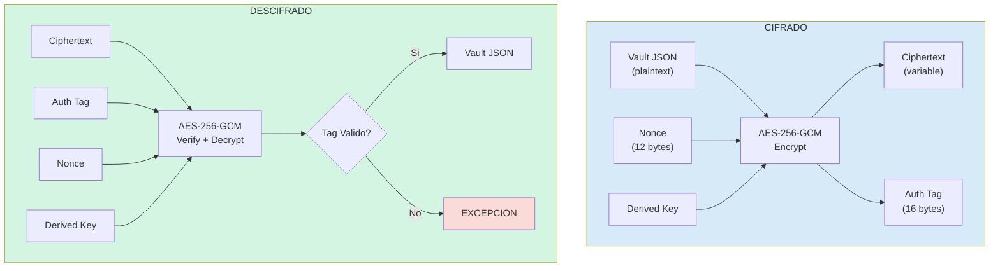
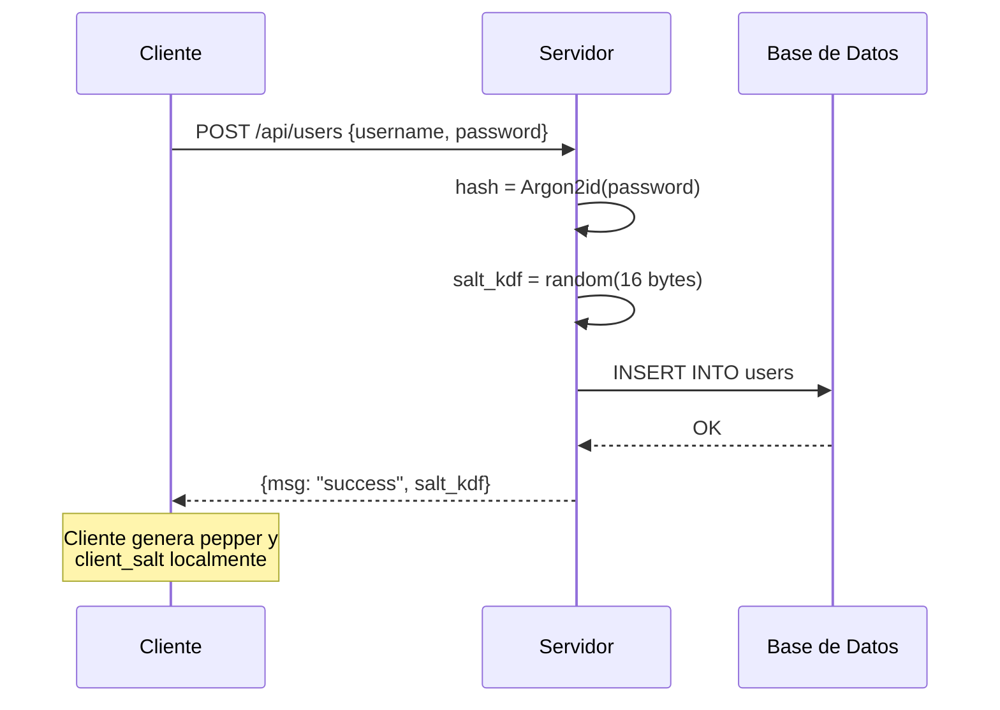
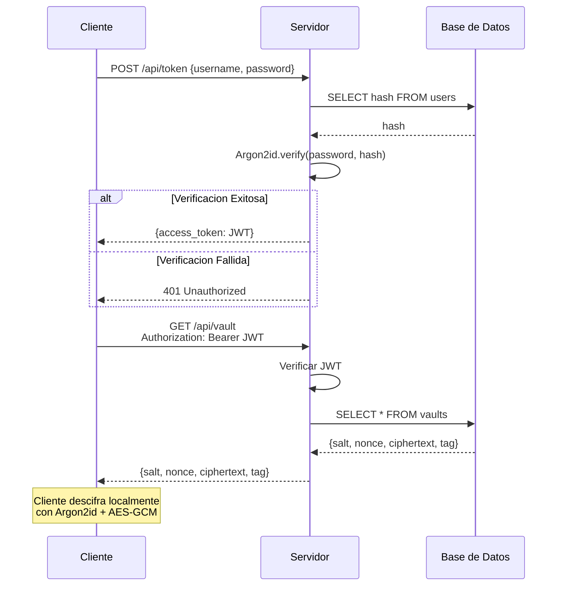
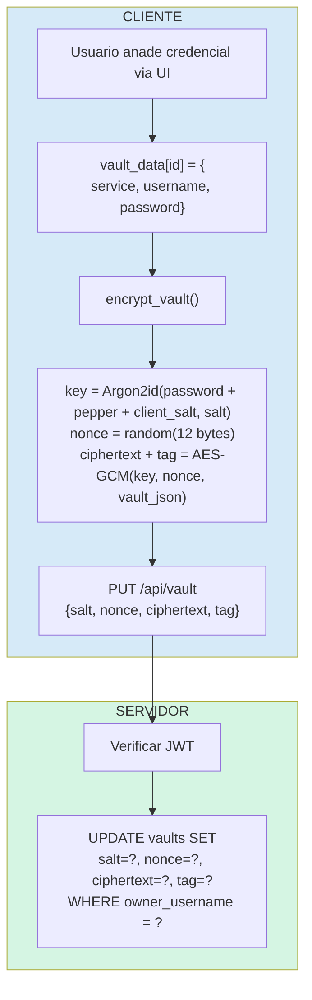
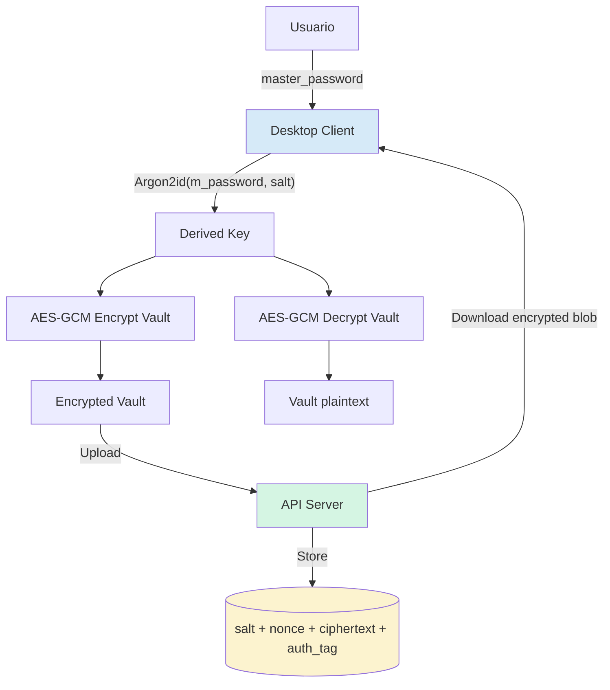
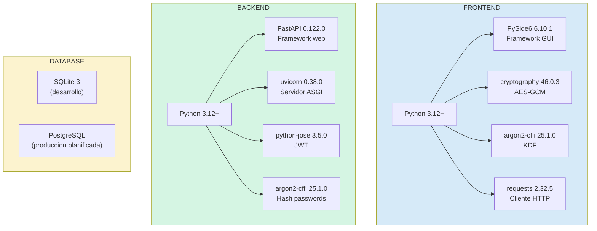
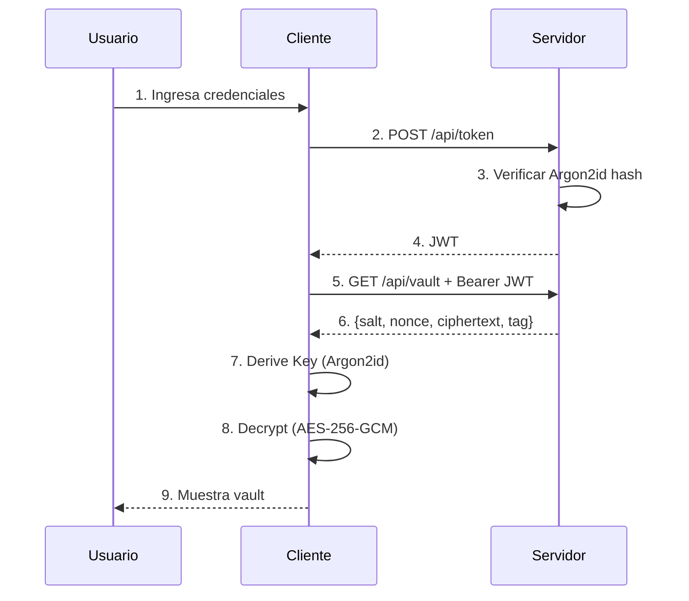

# **Informe Tecnico: Password Manager Criptografico**

## **Informacion del Proyecto**

| **Campo** | **Detalle** |
|-----------|-------------|
| **Curso** | Criptografia |
| **Semestre** | 2025-2 |
| **Universidad** | UTEC |
| **Repositorio** | [GitHub - DavidHerencia/password_manager_crypto](https://github.com/DavidHerencia/password_manager_crypto) |
| **Rama Principal** | `acl` |

---

## **Indice**

1. [Resumen Ejecutivo](#1-resumen-ejecutivo)
2. [Arquitectura del Sistema](#2-arquitectura-del-sistema)
3. [Analisis Criptografico Detallado](#3-analisis-criptografico-detallado)
4. [Flujos de Datos y Procesos](#4-flujos-de-datos-y-procesos)
5. [Implementacion Tecnica](#5-implementacion-tecnica)
6. [Analisis de Seguridad](#6-analisis-de-seguridad)
7. [Tecnologias y Dependencias](#7-tecnologias-y-dependencias)
8. [Manual de Instalacion y Uso](#8-manual-de-instalacion-y-uso)
9. [Analisis de Vulnerabilidades y Mitigaciones](#9-analisis-de-vulnerabilidades-y-mitigaciones)
10. [Conclusiones y Trabajo Futuro](#10-conclusiones-y-trabajo-futuro)
11. [Referencias](#11-referencias)

---

## **1. Resumen Ejecutivo**

### 1.1 Descripcion del Proyecto

Este proyecto implementa un **administrador de contrasenas seguro** con arquitectura de **conocimiento cero (zero-knowledge)**. El sistema garantiza que el servidor actue unicamente como almacen de datos cifrados, sin tener jamas acceso al contenido en texto plano de las credenciales del usuario.

### 1.2 Objetivos de Seguridad

| **Objetivo** | **Descripcion** | **Mecanismo** |
|--------------|-----------------|---------------|
| **Confidencialidad** | Las credenciales nunca son visibles en texto plano fuera del cliente | Cifrado AES-256-GCM |
| **Integridad** | Deteccion de cualquier manipulacion de datos | Authentication Tag (GCM) |
| **Autenticidad** | Verificacion de origen de los datos | AEAD + JWT |
| **No Repudio** | Trazabilidad de operaciones | Logs + Tokens firmados |
| **Resistencia a Ataques Offline** | Proteccion contra fuerza bruta | Argon2id con alto costo |

### 1.3 Modelo de Amenazas

El sistema esta disenado para proteger contra:

- **Atacante con acceso a la base de datos**: Datos cifrados, inutiles sin la clave
- **Atacante que intercepta trafico**: Cifrado end-to-end en cliente
- **Servidor comprometido**: Zero-knowledge, el servidor no ve datos en claro
- **Ataques de fuerza bruta**: Argon2id con parametros computacionalmente costosos
- **Manipulacion de datos**: AEAD detecta cualquier modificacion

---

## **2. Arquitectura del Sistema**

### 2.1 Diagrama de Arquitectura General



### 2.2 Componentes del Sistema

#### 2.2.1 Cliente Desktop (`frontend/`)

| **Archivo** | **Responsabilidad** |
|-------------|---------------------|
| `main.py` | Logica de la aplicacion, ventanas, dialogos, workers asincronos |
| `crypto_engine.py` | Motor criptografico: KDF, cifrado, descifrado, generacion de passwords |
| `ui.py` | Estilos y tema visual de la aplicacion |

#### 2.2.2 Backend API (`backend/`)

| **Archivo** | **Responsabilidad** |
|-------------|---------------------|
| `main.py` | Endpoints FastAPI, autenticacion JWT, validacion |
| `database.py` | Abstraccion de base de datos, CRUD de usuarios y vaults |

---

## **3. Analisis Criptografico Detallado**

### 3.1 Key Derivation Function (KDF)

#### Algoritmo: **Argon2id**

```python
# Implementacion en crypto_engine.py
from argon2.low_level import hash_secret_raw, Type

def derive_key(password: str, salt: bytes) -> bytes:
    secrets_payload = _load_or_create_client_secrets()
    pepper_bytes = bytes.fromhex(secrets_payload["pepper"])
    client_salt_bytes = bytes.fromhex(secrets_payload["client_salt"])
    
    # Combinacion segura de secretos
    secret = password.encode("utf-8") + pepper_bytes + client_salt_bytes
    
    return hash_secret_raw(
        secret, salt,
        time_cost=3,        # Iteraciones
        memory_cost=65536,  # 64 MB de memoria
        parallelism=2,      # Hilos paralelos
        hash_len=32,        # 256 bits de salida
        type=Type.ID        # Argon2id (hibrido)
    )
```

#### Justificacion de Parametros

| **Parametro** | **Valor** | **Justificacion** |
|---------------|-----------|-------------------|
| `time_cost` | 3 | Balance entre seguridad y UX (~1s en hardware moderno) |
| `memory_cost` | 65536 (64 MB) | Resistencia a ataques con GPUs/ASICs |
| `parallelism` | 2 | Aprovecha CPUs multi-core sin saturar |
| `hash_len` | 32 bytes | Clave AES-256 directa |
| `type` | Argon2id | Combina resistencia a side-channels y tradeoff attacks |

#### Diagrama de Derivacion de Clave



### 3.2 Cifrado Autenticado (AEAD)

#### Algoritmo: **AES-256-GCM**

```python
# Implementacion en crypto_engine.py
from cryptography.hazmat.primitives.ciphers.aead import AESGCM

def encrypt_vault(vault_dict, password, salt=None):
    if salt is None:
        salt = os.urandom(16)
    
    key = derive_key(password, salt)
    aesgcm = AESGCM(key)
    nonce = os.urandom(12)  # 96 bits, unico por cifrado
    
    data = json.dumps(vault_dict).encode()
    ct = aesgcm.encrypt(nonce, data, None)
    
    ciphertext, tag = ct[:-16], ct[-16:]
    
    return {
        "salt": salt.hex(),
        "nonce": nonce.hex(),
        "ciphertext": ciphertext.hex(),
        "tag": tag.hex()
    }
```

#### Propiedades de AES-256-GCM

| **Propiedad** | **Descripcion** |
|---------------|-----------------|
| **Confidencialidad** | AES-256 en modo contador (CTR) |
| **Integridad** | GHASH produce authentication tag de 128 bits |
| **Autenticidad** | El tag verifica que el mensaje no fue modificado |
| **Velocidad** | Aceleracion por hardware (AES-NI) en CPUs modernas |

#### Diagrama de Cifrado/Descifrado



### 3.3 Autenticacion de Sesion (JWT)

#### Flujo de Autenticacion

```python
# backend/main.py
from jose import JWTError, jwt

SECRET_KEY = "criptoRules123"  # En produccion: clave segura aleatoria
ALGORITHM = "HS256"

def create_access_token(data: dict):
    return jwt.encode(data, SECRET_KEY, algorithm=ALGORITHM)
```

#### Estructura del JWT

```
Header: {"alg": "HS256", "typ": "JWT"}
Payload: {"sub": "username", "exp": <timestamp>}
Signature: HMAC-SHA256(header.payload, SECRET_KEY)
```

---

## **4. Flujos de Datos y Procesos**

### 4.1 Flujo de Registro de Usuario



### 4.2 Flujo de Login y Obtencion de Vault



### 4.3 Flujo de Guardado de Credencial



### 4.4 Flujo Completo del Sistema



---

## **5. Implementacion Tecnica**

### 5.1 Estructura del Proyecto

```
password_manager_crypto/
|-- backend/
|   |-- main.py           # FastAPI endpoints
|   |-- database.py       # SQLite abstraction
|   +-- vault.db          # Base de datos (generada)
|-- frontend/
|   |-- main.py           # UI principal (PySide6)
|   |-- crypto_engine.py  # Motor criptografico
|   +-- ui.py             # Estilos visuales
|-- app/
|   +-- test_ui.py        # Tests de UI
|-- pyproject.toml        # Dependencias del proyecto
|-- README.md             # Documentacion de diseno
|-- API_USAGE.md          # Ejemplos de uso de la API
+-- INFORME_TECNICO.md    # Este documento
```

### 5.2 Codigo Critico Analizado

#### 5.2.1 Generacion de Secretos Locales del Cliente

```python
# crypto_engine.py - Lineas 35-70
def _load_or_create_client_secrets() -> dict[str, str]:
    """
    Genera o carga pepper y salt locales del cliente.
    
    Seguridad:
    - Permisos 0o700 en directorio (solo usuario)
    - Permisos 0o600 en archivo (solo lectura/escritura usuario)
    - 256 bits de entropia por secreto
    """
    CONFIG_DIR.mkdir(parents=True, exist_ok=True)
    if os.name != "nt":
        CONFIG_DIR.chmod(0o700)  # rwx------
    
    if not CLIENT_SECRETS_FILE.exists():
        secrets_payload = {
            "pepper": secrets.token_hex(32),      # 256 bits
            "client_salt": secrets.token_hex(32)  # 256 bits
        }
        with CLIENT_SECRETS_FILE.open("w") as fh:
            json.dump(secrets_payload, fh)
        if os.name != "nt":
            os.chmod(CLIENT_SECRETS_FILE, 0o600)  # rw-------
    
    return json.load(CLIENT_SECRETS_FILE.open("r"))
```

#### 5.2.2 Verificacion de Integridad en Descifrado

```python
# crypto_engine.py - Lineas 100-130
def decrypt_vault(blob, password):
    try:
        salt = bytes.fromhex(blob["salt"])
        nonce = bytes.fromhex(blob["nonce"])
        ciphertext = bytes.fromhex(blob["ciphertext"])
        tag = bytes.fromhex(blob["tag"])
    except (KeyError, ValueError) as exc:
        print(f"Error en formato del blob: {exc}")
        return {}  # Fail-safe
    
    ct = ciphertext + tag  # GCM espera ciphertext||tag
    
    try:
        key = derive_key(password, salt)
        aesgcm = AESGCM(key)
        data = aesgcm.decrypt(nonce, ct, None)
        # Si el tag es invalido, decrypt() lanza excepcion
        return json.loads(data.decode())
    except Exception as e:
        print(f"Error de autenticacion/descifrado: {e}")
        return {}  # No revelar detalles del error
```

#### 5.2.3 Endpoint de Autenticacion Segura

```python
# backend/main.py - Lineas 45-60
@app.post("/api/token", response_model=Token)
def login(form_data: OAuth2PasswordRequestForm = Depends()):
    user = database.get_user(form_data.username)
    if not user or not verify_password(form_data.password, user["hash"]):
        raise HTTPException(
            status_code=HTTP_401_UNAUTHORIZED,
            detail="Incorrect username or password"
            # Mensaje generico: no revelar si usuario existe
        )
    
    token = create_access_token({"sub": user["username"]})
    return {"access_token": token, "token_type": "bearer"}
```

### 5.3 Generador de Contrasenas

```python
# crypto_engine.py - Lineas 260-275
def generate_password(length=16, use_uppercase=True, 
                      use_numbers=True, use_symbols=True):
    """
    Genera contrasena segura usando random.choice().
    
    NOTA: Para produccion, usar secrets.choice() para
    mejor calidad criptografica.
    """
    chars = string.ascii_lowercase
    if use_uppercase:
        chars += string.ascii_uppercase
    if use_numbers:
        chars += string.digits
    if use_symbols:
        chars += string.punctuation
    
    return ''.join(random.choice(chars) for _ in range(length))
```

---

## **6. Analisis de Seguridad**

### 6.1 Propiedades de Seguridad Logradas

| **Propiedad** | **Mecanismo** | **Estado** |
|---------------|---------------|------------|
| Zero-Knowledge | Cifrado cliente, servidor solo ve blobs | Implementado |
| Confidencialidad | AES-256-GCM | Implementado |
| Integridad | GCM Auth Tag (GHASH) | Implementado |
| Resistencia Offline | Argon2id (64MB, 3 iter) | Implementado |
| Autenticacion | JWT con HMAC-SHA256 | Implementado |
| Secretos Locales | Pepper + Salt cliente | Implementado |

### 6.2 Analisis de Seguridad de la Clave Derivada

#### Entropia de la Clave

```
Componentes de entrada:
-------------------------------------------------------------
Master Password:   Variable (~40-80 bits tipico)
Server Salt:       128 bits (16 bytes aleatorios)
Client Pepper:     256 bits (32 bytes aleatorios)
Client Salt:       256 bits (32 bytes aleatorios)
-------------------------------------------------------------
Total entropia:    > 640 bits (sin contar password)
```

#### Costo de Ataque de Fuerza Bruta

```
Parametros Argon2id:
- Memoria: 64 MB por intento
- Tiempo: ~1 segundo por intento en CPU moderno

Suponiendo 1 millon de GPUs con 16GB VRAM cada una:
- Intentos paralelos por GPU: 16GB / 64MB = 256
- Total intentos/segundo: 1M x 256 = 256M

Para contrasena de 80 bits de entropia:
- Espacio de busqueda: 2^80 = 1.2 x 10^24
- Tiempo de crackeo: 2^80 / 256M = ~4.7 x 10^15 segundos
                    = 149 millones de anos
```

### 6.3 Analisis del Nonce (GCM)

```
Tamano del nonce: 96 bits (12 bytes)
Generacion: os.urandom() -> CSPRNG del sistema

Riesgo de colision (Birthday Paradox):
-------------------------------------------------------------
Numero de cifrados seguros: 2^(96/2) = 2^48 = 281 billones
Cifrados por usuario tipico: ~1000/ano
Anos hasta riesgo significativo: 281 mil millones de anos
-------------------------------------------------------------
Conclusion: Riesgo de reuso de nonce despreciable
```

---

## **7. Tecnologias y Dependencias**

### 7.1 Stack Tecnologico



### 7.2 Dependencias Completas (pyproject.toml)

| **Paquete** | **Version** | **Proposito** |
|-------------|-------------|---------------|
| `pyside6` | 6.10.1 | Interfaz grafica multiplataforma |
| `cryptography` | 46.0.3 | AES-GCM, primitivas criptograficas |
| `argon2-cffi` | 25.1.0 | KDF Argon2id |
| `fastapi` | 0.122.0 | Framework API REST |
| `uvicorn` | 0.38.0 | Servidor ASGI |
| `python-jose` | 3.5.0 | JWT encoding/decoding |
| `requests` | 2.32.5 | Cliente HTTP |
| `pydantic` | 2.12.5 | Validacion de datos |

---

## **8. Manual de Instalacion y Uso**

### 8.1 Requisitos del Sistema

- Python 3.12 o superior
- Sistema operativo: Linux, macOS, Windows
- 100 MB de espacio en disco
- Conexion de red (para comunicacion cliente-servidor)

### 8.2 Instalacion

```bash
# 1. Clonar el repositorio
git clone https://github.com/DavidHerencia/password_manager_crypto.git
cd password_manager_crypto

# 2. Crear entorno virtual
python -m venv .venv
source .venv/bin/activate  # Linux/macOS
# .venv\Scripts\activate   # Windows

# 3. Instalar dependencias
pip install -e .
# O usando uv:
uv sync
```

### 8.3 Ejecucion

```bash
# Terminal 1: Iniciar el backend
cd backend
python main.py
# Servidor corriendo en http://localhost:8000

# Terminal 2: Iniciar el frontend
cd frontend
python main.py
```

### 8.4 Uso de la API (ejemplos)

```bash
# Registrar usuario
curl -X POST http://localhost:8000/api/users \
  -H "Content-Type: application/json" \
  -d '{"username": "usuario1", "password": "contrasena_segura"}'

# Login (obtener JWT)
curl -X POST http://localhost:8000/api/token \
  -d "username=usuario1&password=contrasena_segura"

# Obtener vault (requiere JWT)
curl -X GET http://localhost:8000/api/vault \
  -H "Authorization: Bearer <JWT_TOKEN>"
```

---

## **9. Analisis de Vulnerabilidades y Mitigaciones**

### 9.1 Matriz de Amenazas y Mitigaciones

| **Amenaza** | **Vector** | **Impacto** | **Mitigacion** | **Estado** |
|-------------|------------|-------------|----------------|------------|
| Fuerza bruta offline | Robo de DB | Critico | Argon2id (64MB, 3 iter) | Implementado |
| Intercepcion de trafico | Red insegura | Alto | Cifrado en cliente (ver mejoras futuras) | Parcial |
| Replay attack | Intercepcion JWT | Medio | JWT con expiracion corta | Implementado |
| SQL Injection | Entrada maliciosa | Critico | Queries parametrizadas | Implementado |
| XSS/Injection | UI Desktop | Bajo | No aplica (no web) | N/A |
| Manipulacion de datos | Modificar blob | Alto | GCM Auth Tag | Implementado |
| Credential stuffing | Passwords filtradas | Alto | Rate limiting | Pendiente |
| Memoria no limpiada | Dump de memoria | Medio | Limpieza explicita | Pendiente |

### 9.2 Vulnerabilidades Identificadas y Pendientes

#### 9.2.1 SECRET_KEY Hardcodeada (CRITICO)

```python
# backend/main.py - PROBLEMA
SECRET_KEY = "criptoRules123"  # Hardcodeado

# SOLUCION PROPUESTA
import os
SECRET_KEY = os.environ.get("JWT_SECRET_KEY")
if not SECRET_KEY:
    raise RuntimeError("JWT_SECRET_KEY no configurada")
```

#### 9.2.2 Generador de Contrasenas usa `random` (MODERADO)

```python
# crypto_engine.py - PROBLEMA
import random
return ''.join(random.choice(chars) for _ in range(length))

# SOLUCION PROPUESTA
import secrets
return ''.join(secrets.choice(chars) for _ in range(length))
```

#### 9.2.3 Sin Rate Limiting (MODERADO)

```python
# SOLUCION PROPUESTA - Agregar a backend/main.py
from slowapi import Limiter
from slowapi.util import get_remote_address

limiter = Limiter(key_func=get_remote_address)

@app.post("/api/token")
@limiter.limit("5/minute")
def login(request: Request, form_data: ...):
    ...
```

### 9.3 Recomendaciones de Seguridad

1. **Inmediato**: Cambiar `random` por `secrets` en el generador de passwords
2. **Inmediato**: Mover `SECRET_KEY` a variable de entorno
3. **Corto plazo**: Implementar rate limiting en endpoints de autenticacion
4. **Mediano plazo**: Implementar limpieza segura de memoria sensible
5. **Mediano plazo**: Anadir logs de auditoria

---

## **10. Conclusiones y Trabajo Futuro**

### 10.1 Logros del Proyecto

| **Logro** | **Descripcion** |
|-----------|-----------------|
| Arquitectura Zero-Knowledge | El servidor nunca tiene acceso a datos en texto plano |
| Criptografia Robusta | Uso de primitivas modernas y probadas (Argon2id, AES-256-GCM) |
| Separacion de Responsabilidades | Cliente maneja toda la criptografia, servidor solo almacena blobs |
| Autenticacion Segura | JWT con verificacion de firma |
| Defensa en Profundidad | Multiples capas de secretos (password + pepper + salts) |
| Interfaz Funcional | UI completa con PySide6 |

### 10.2 Trabajo Futuro y Mejoras Pendientes

| **Mejora** | **Prioridad** | **Descripcion** |
|------------|---------------|-----------------|
| Comunicacion Cifrada (HTTPS/TLS) | Alta | Implementar HTTPS con certificado SSL para proteger el trafico en transito y prevenir ataques MITM |
| Rate Limiting | Alta | Prevenir ataques de fuerza bruta al endpoint de login |
| Secrets en Variables de Entorno | Alta | Remover hardcoding de SECRET_KEY |
| Limpieza de Memoria | Media | Borrado seguro de claves en RAM |
| 2FA/MFA | Media | Segundo factor de autenticacion |
| Auditoria de Logs | Media | Registro de accesos y operaciones |
| Backup Cifrado | Baja | Export/Import de vault cifrado |
| Sincronizacion Multi-dispositivo | Baja | Compartir vault entre dispositivos |

**Nota importante sobre la comunicacion**: Actualmente el proyecto utiliza HTTP para la comunicacion cliente-servidor. Para un entorno de produccion, es **altamente recomendado** implementar HTTPS/TLS con un certificado SSL valido para:
- Proteger las credenciales en transito
- Prevenir ataques de tipo Man-in-the-Middle (MITM)
- Garantizar la integridad de los datos transmitidos
- Cumplir con estandares de seguridad de la industria

### 10.3 Lecciones Aprendidas

1. **La criptografia debe ser del lado del cliente** para lograr zero-knowledge
2. **Argon2id** es superior a PBKDF2/bcrypt para KDF moderno
3. **AEAD (GCM)** simplifica el cifrado al combinar confidencialidad e integridad
4. **Los secretos locales** (pepper, client_salt) anaden seguridad contra robo de BD
5. **El manejo de nonces** es critico: nunca reutilizar (key, nonce)

---

## **11. Referencias**

### 11.1 Estandares y RFCs

- [RFC 5116](https://tools.ietf.org/html/rfc5116) - An Interface and Algorithms for Authenticated Encryption
- [RFC 7519](https://tools.ietf.org/html/rfc7519) - JSON Web Token (JWT)
- [RFC 9106](https://tools.ietf.org/html/rfc9106) - Argon2 Memory-Hard Function

### 11.2 Documentacion de Librerias

- [cryptography.io](https://cryptography.io/en/latest/) - Documentacion de la libreria cryptography
- [argon2-cffi](https://argon2-cffi.readthedocs.io/) - Bindings de Argon2 para Python
- [FastAPI](https://fastapi.tiangolo.com/) - Framework web moderno
- [PySide6/Qt](https://doc.qt.io/qtforpython-6/) - Framework de UI

### 11.3 Recursos de Seguridad

- [OWASP Password Storage Cheat Sheet](https://cheatsheetseries.owasp.org/cheatsheets/Password_Storage_Cheat_Sheet.html)
- [OWASP Cryptographic Storage Cheat Sheet](https://cheatsheetseries.owasp.org/cheatsheets/Cryptographic_Storage_Cheat_Sheet.html)
- [NIST SP 800-38D](https://csrc.nist.gov/publications/detail/sp/800-38d/final) - Recommendation for Block Cipher Modes of Operation: GCM

---

## **Anexo A: Diagrama de Secuencia Completo**



---

## **Anexo B: Checklist de Seguridad**

### Pre-Produccion

- [ ] Cambiar `SECRET_KEY` a variable de entorno
- [ ] Cambiar `random` por `secrets` en generador
- [ ] Implementar rate limiting
- [ ] Configurar comunicacion cifrada (HTTPS/TLS)
- [ ] Ejecutar analisis estatico con `bandit`
- [ ] Revisar permisos de archivos de configuracion

### Produccion

- [ ] Migrar de SQLite a PostgreSQL
- [ ] Configurar backups automatizados
- [ ] Implementar logging y monitoreo
- [ ] Configurar WAF (Web Application Firewall)
- [ ] Establecer politica de rotacion de claves
- [ ] Documentar procedimiento de recuperacion

---

**Documento generado el:** 4 de Diciembre de 2025  
**Version:** 1.1  
**Autor:** Generado automaticamente a partir del analisis del codigo fuente
