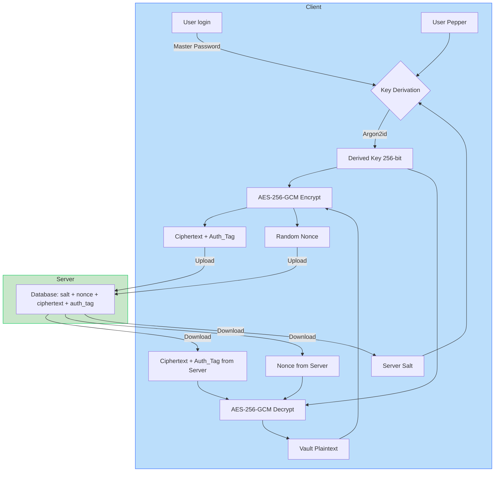
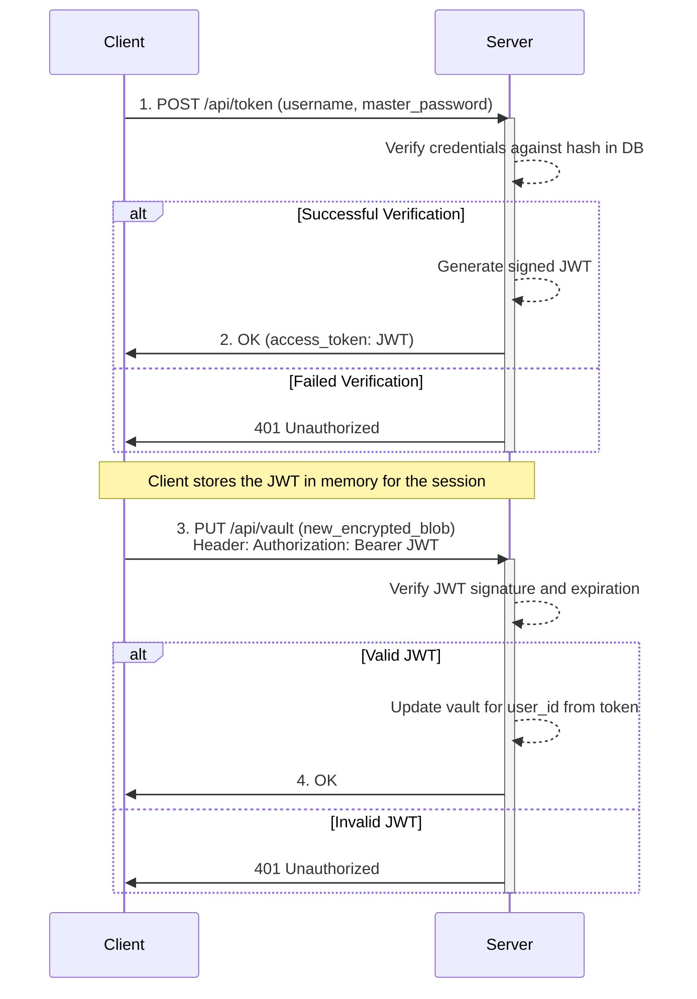
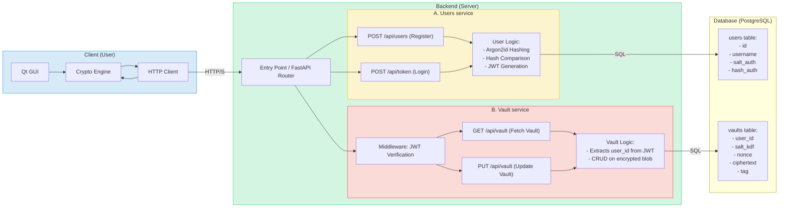
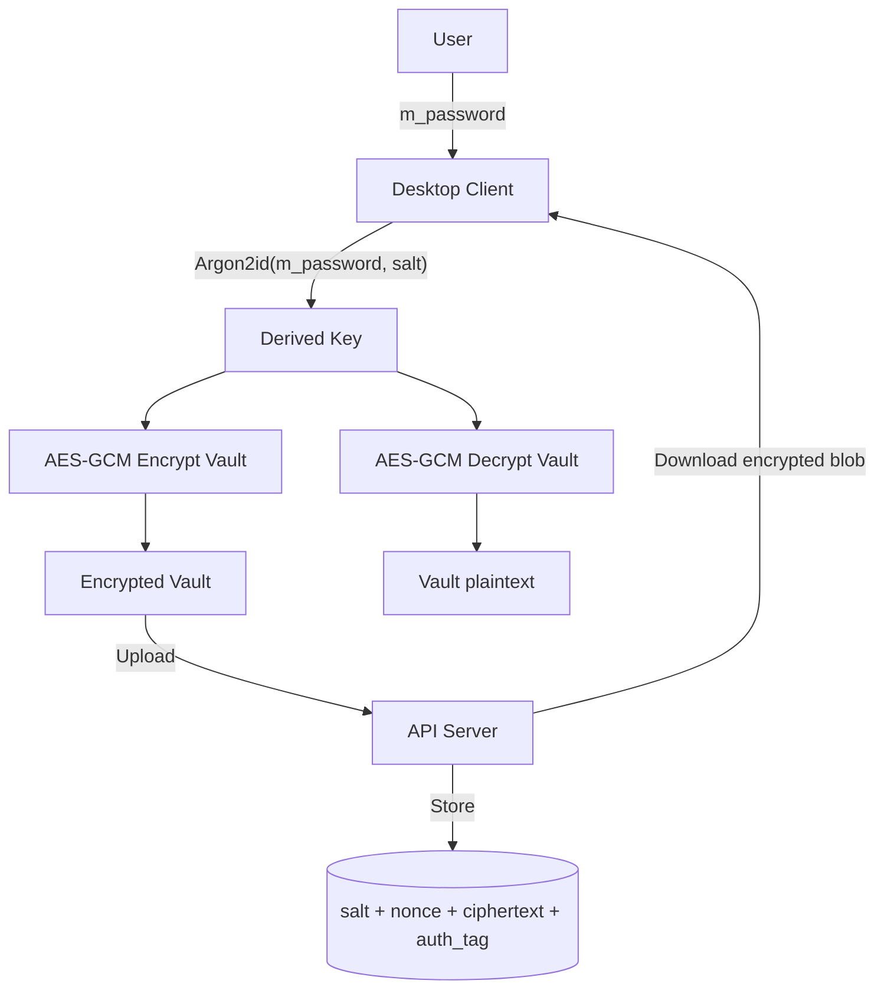

# **Password Manager Criptográfico - Diseño de Sistema (Entrega 1)**

## 1. Resumen del Proyecto
Este documento detalla el diseño de un administrador de contraseñas de escritorio con un enfoque primordial en la seguridad y la privacidad del usuario. La arquitectura se basa en un modelo de **conocimiento cero (zero-knowledge)**, donde el servidor actúa únicamente como un almacén de datos cifrados, sin tener jamás la capacidad de acceder al contenido en texto plano. Se utilizan primitivos criptográficos modernos y probados para garantizar la confidencialidad, integridad y autenticidad de las credenciales del usuario.

## 2. Objetivos de la Entrega 1
- **Definir la arquitectura** de la solución, incluyendo cliente, servidor y almacenes de datos.
- **Seleccionar y justificar** los algoritmos y librerías criptográficas alineados con las mejores prácticas actuales.
- **Documentar los flujos de datos críticos**, especialmente los procesos de cifrado y autenticación.
- **Prototipar la interfaz de usuario** y describir las funcionalidades principales.

## 3. Arquitectura General
La solución se compone de un cliente de escritorio nativo y una API REST minimalista que se comunican exclusivamente a través de un canal seguro (TLS).

```
┌──────────────────┐     TLS (HTTPS)     ┌────────────────────────────┐
│  Cliente Desktop │───────────────────▶ │       Servidor API REST    │
│  - UI (Python)   │ ◀─────────────────── │ - Autenticación (JWT)      │
│  - Criptografía  │                     │ - Almacenamiento de Blobs  │
└────────┬─────────┘                     └────────────┬───────────────┘
         │                                            │
         │ 1. KDF con Argon2id (Client-Side)          │ 2. Persistencia de Datos Cifrados
         ▼                                            ▼
┌──────────────────┐                        ┌────────────────────────────┐
│  Clave Derivada  │                        │ Base de Datos (PostgreSQL) │
│ (Solo en memoria)│                        │ (salt + nonce + ciphertext + tag) │
└──────────────────┘                        └────────────────────────────┘
```

- **Cliente (Desktop)**: Aplicación responsable de toda la lógica criptográfica. Gestiona la interfaz de usuario, deriva la clave de cifrado a partir de la contraseña maestra, cifra y descifra el vault localmente. **La contraseña maestra y la clave de cifrado nunca abandonan el cliente.**
- **Servidor (API REST)**: Su única función es (1) autenticar al usuario y emitir un token de sesión (JWT), y (2) almacenar y servir un único blob de datos cifrados por usuario. No tiene conocimiento alguno sobre el contenido del blob.

## 4. Flujos Criptográficos Detallados

### 4.1. Derivación de Clave de Cifrado (KDF)
La clave que cifra el vault se deriva en el cliente utilizando un KDF (Key Derivation Function) robusto para resistir ataques de fuerza bruta offline.
- **Algoritmo**: **Argon2id**.
- **Entradas**:
    1.  **Contraseña Maestra**: Proporcionada por el usuario.
    2.  **Salt**: 16 bytes generados aleatoriamente durante el registro del usuario. Se almacena en el servidor junto al vault cifrado.
- **Parámetros de Argon2id**: `time_cost=3`, `memory_cost=65536` (64 MB), `parallelism=2`, `hash_len=32` (para una clave AES-256).
- **Salida**: Una clave de cifrado simétrica de 32 bytes (`Derived Key`).

### 4.2. Cifrado y Descifrado del Vault (AEAD)
Para garantizar tanto la confidencialidad como la integridad, se utiliza un modo de cifrado autenticado.
- **Algoritmo**: **AES-256-GCM (Galois/Counter Mode)**.
- **Clave**: La `Derived Key` de 32 bytes generada por Argon2id.
- **Nonce**: Un nonce de 12 bytes (96 bits) generado aleatoriamente por **cada operación de cifrado**. Es esencial que nunca se reutilice un par `(clave, nonce)`.
- **Proceso**:
    1.  **Cifrado**: Al guardar, el cliente cifra el vault (un documento JSON) con AES-GCM. La operación produce dos salidas: el `ciphertext` (el vault cifrado) y un `auth_tag` de 16 bytes (un MAC que garantiza la integridad y autenticidad).
    2.  **Almacenamiento**: El cliente sube al servidor el `salt`, el `nonce`, el `ciphertext` y el `auth_tag`.
    3.  **Descifrado**: Al cargar, el cliente descarga el blob, recalcula la `Derived Key` y utiliza AES-GCM para verificar el `auth_tag` y descifrar el `ciphertext`. Si el `tag` es inválido (los datos fueron manipulados), la operación falla de forma segura.

### 4.3. Autenticación de Sesión con el Servidor (JWT)
Para que el servidor sepa qué usuario está realizando una petición sin enviar la contraseña maestra repetidamente, se usa un flujo de tokens JWT.
- **Login (`POST /api/token`)**:
    1.  El cliente envía el `username` y la `contraseña maestra` a través de HTTPS.
    2.  El servidor hashea la contraseña recibida con Argon2id (usando un salt de autenticación diferente, almacenado para este fin) y la compara con el hash de autenticación que tiene en su base de datos.
    3.  Si la verificación es exitosa, el servidor genera un **JSON Web Token (JWT)**, firmado con una clave secreta del servidor. Este token contiene el `user_id` y una fecha de expiración corta.
    4.  El JWT es devuelto al cliente.
- **Peticiones Autenticadas (ej. `PUT /api/vault`)**:
    1.  Para todas las peticiones posteriores, el cliente añade una cabecera HTTP: `Authorization: Bearer <JWT>`.
    2.  El servidor verifica la firma y la fecha de expiración de cada JWT recibido. Si es válido, confía en la identidad del `user_id` dentro del token y procesa la petición.

## 5. Diagramas de Flujo

### Diagrama 1: Flujo de Cifrado del Vault (Client-Side)


### Diagrama 2: Flujo de Autenticación de Sesión (Cliente-Servidor)


### Arquitectura de Sistema Completa


## 6. Diseño de Interfaz (Borrador)
- **Pantalla de Desbloqueo**: Campo único para la contraseña maestra.
- **Dashboard Principal**: Lista de credenciales con búsqueda y filtrado. Botones para "Añadir Nueva" y "Sincronizar".
- **Vista/Edición de Credencial**: Formulario modal con campos para nombre, usuario, contraseña (con opción de mostrar/ocultar), generador de contraseñas integrado y notas.
- **Generador de Contraseñas**: Opciones configurables (longitud, tipos de caracteres) y botón de refresco.

## 7. Seguridad Práctica y Mitigaciones
| Amenaza | Mitigación |
| :--- | :--- |
| **Ataque Offline al Vault** | KDF **Argon2id** con alto coste de memoria para ralentizar ataques de fuerza bruta |
| **Manipulación de Datos** | Cifrado autenticado **AES-GCM**. El **auth_tag** (MAC) previene cualquier modificación no detectada del vault en tránsito o en reposo. |
| **Intercepción de Tráfico** | Comunicación exclusivamente sobre **TLS 1.2+ (HTTPS)** con validación estricta de certificados. |
| **Acceso no autorizado a la API** | Autenticación de sesión con **JWTs** de corta duración. Todas las acciones requieren un token válido. |
| **Fuerza Bruta al Login** | **Rate limiting** y bloqueo temporal de IP/cuenta en el endpoint de autenticación del servidor. |
| **Memoria Insegura** | Limpieza explícita de buffers que contengan la contraseña maestra o la clave derivada tan pronto como dejen de ser necesarios. |

## 8. Tecnologías y Librerías
- **Cliente**: Python + `cryptography`, `argon2-cffi`.
- **Servidor**: Python + `FastAPI`, `Uvicorn`, `SQLAlchemy`.
- **Base de Datos**: SQLite (desarrollo), PostgreSQL (producción).

## 9. Próximos Pasos (Hacia Entrega 2)
1.  Implementar el prototipo mínimo del cliente (CLI o GUI simple).
2.  Desarrollar los endpoints de la API REST para autenticación y almacenamiento.
3.  Integrar la lógica criptográfica completa en el cliente.
4.  Realizar análisis de seguridad estático del código con `bandit`.


### Diagrama Encriptación Mermaid
